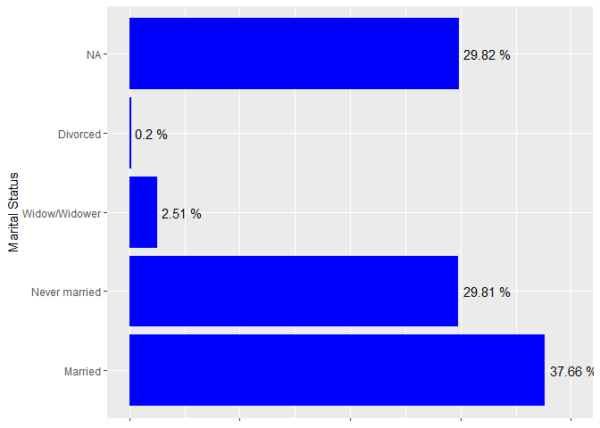
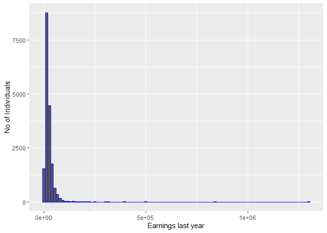
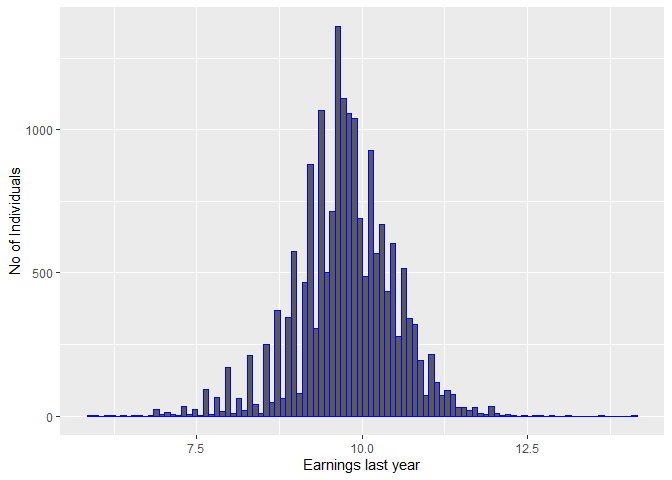
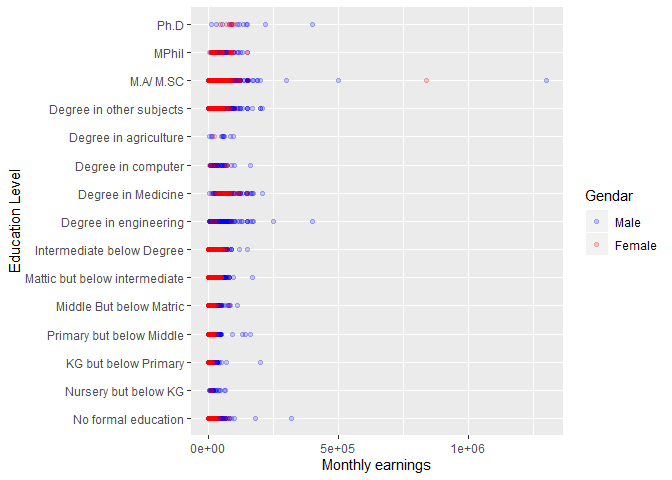

```r
knitr::opts_chunk$set(echo = TRUE)
```


## Exploring LFS data using dplyr

There is huge amount of data collected at national and provincial level through various surveys. Most of the times this data remain unexplored and purpose of having data is not fulfilled properly. One of the reasons is that dealing with survey data is always time consuming and requires more skills than handling macroeconomic variables. Therefore, working with survey data, as per anecdotal evidence, is usually not a first preference of research students at post-graduate level.  
    One of the main objective of this document is to provide a document to students/scholars/academia/policy  which enables them to use the data easily. Secondly, R is mainly used these days but learning curve of R is steep. However, some of the packages in R like __tidyverse__ which consists of a number of packages including dplyr and ggplot2 make data transformation easier and faster. It has gained great popularity among R users and experise in it is one of the standard skill in R and is in high demand. By learning some fundamentals of __R__ for which I have uploaded [tutorials](https://www.youtube.com/c/datavisualizationandanalytics_ZahidAsghar), [how to install R and R Studio](https://www.youtube.com/watch?v=ZNBZevfYgo0) and some other videos which are labelled in playlist under *Econometric Analysis Using R* .
In the following I give an introduction to some main functions of dplyr and use it for LFS data. I shall elaborate some of the most extensively used functions of dplyr. Using LFS data makes it not only a learning exercise of dplyr but will also make it possible for many scholars to work with LFS data for research and policy analysis.
 
### Uploading Required Libraries
What are __R__ packages and libraries, please watch [video](https://youtu.be/SRSNdCZ_QnE).


```r
setwd("C:/Users/hp/OneDrive - Higher Education Commission")
library(foreign)
library(haven)
library(tidyverse)
```

```
## -- Attaching packages ----------------------------------------------------------- tidyverse 1.2.1 --
```

```
## v ggplot2 3.2.1     v purrr   0.3.2
## v tibble  2.1.3     v dplyr   0.8.3
## v tidyr   1.0.2     v stringr 1.4.0
## v readr   1.3.1     v forcats 0.4.0
```

```
## Warning: package 'tidyr' was built under R version 3.6.3
```

```
## -- Conflicts -------------------------------------------------------------- tidyverse_conflicts() --
## x dplyr::filter() masks stats::filter()
## x dplyr::lag()    masks stats::lag()
```

```r
library(gridExtra)
```

```
## Warning: package 'gridExtra' was built under R version 3.6.2
```

```
## 
## Attaching package: 'gridExtra'
```

```
## The following object is masked from 'package:dplyr':
## 
##     combine
```

```r
##LFS<-read_spss("LFS_labels.sav")
##input_data<-read.spss("LFS_labels.sav",use.value.labels = TRUE,to.data.frame = TRUE)
## saveRDS(input_data,file = "LFSurvey.rds")
LFSurvey<-readRDS("LFSurvey.rds")
```

### Selecting Variables
 
Instead of using whole data set, we select variables which will be used for carrying out this analsysis. You can use glimplse(LFS) and View(LFS) data commands with in this code chunk to see more details about data.


```r
LFS<-LFSurvey %>% 
  select(Gendar = S04C05 ,Age = S04C06, Marital_Status = S04C07, Literacy = S04C08, Edu_Level = S04C09, vocational_training = S04C11, duration_of_training_weeks = S04C13, last_month_earning_kind = S07C042, last_month_earning_cash = S07C043, enterprise_type = S05C11, earning_last_year = S07C053, education_level,occupation, industry,Region,PROVINCE,prov6) 
```

### Recoding Variables

In thd following chunk, we are recoding the variables: enterprise_type, Education_level and occupation. After recoding we use the command (or dplyr verb) __mutate__ for recoding. Additionally, most of the variables selected are factor (categorical), one needs to specify these variables as factors. Therefore we have specified these variables as factors. For more on dplyr verbs (commands), you may watch my video [dplyr mutate verb](https://www.youtube.com/watch?v=U9ETTwGYRUY). For other dplyr commands see videos exploring data part1 and part 2.


```r
LFS <- mutate(LFS, enterprise_type_desc=recode(enterprise_type,'1'="Federal",'2'="Provincial",'3'="Local_body",'4'="Pub_Ent", '5'="Pub_Lim",'6'="Pvt_lim",'7'="Coop_Soc",'8'="Inv_own",'9'="Partnership",'10'="Other", .default = "Unmatched", .missing = "N/A"), Edu_Yrs=recode(education_level,"No formal education" = 0,"Nursery but below KG" = 0.5,"KG but below Primary" = 1, "Primary but below Middle" = 6, "Middle But below Matric" = 9, "Mattic but below intermediate" = 11, "Intermediate below Degree" = 12, "Degree in engineering" = 16, "Degree in Medicine" = 16,"Degree in computer" = 16), Main_occ=recode(occupation, 'Chief Exective, senior officials and legislators'="Managerial",'Admistrative and Commercial Managers'="Managerial",'Production and specialized service Managers'="Managerial",'Hospitality retail and other service Managers'="Managerial",'Science and engineering profesioanls'="Professionals",'Health professionals'="Professionals",'Teaching professionals'="Professionals",'Business and administration professionals'="Professionals", 'Informaion and communication technology professional'="Professionals",'Information and communication technology professional'="Professionals",'legal, social and cultural professional'="Professionals",'Scinnce and engineering associate professional'="Technician", 'Business and adminstration assocaite professionals'="Technician", 'Legal, social cultural and related associate professional'="Technician", 'Health associate professional'="Technician",'Informtion and communication Technician'="Technician",'Informtion and communication technicians'="Clerks" ,'Clerical and keyboard clerks'="Clerks", 'Business and adminstration assocaite professionals'="Clerks", 'Legal, social cultural and related associate professional'="Clerks", 'Informtion and communication Technician'="Clerks",'Clerical and keyboard clerks'="Clerks",'42'="Clerks", 'Numerical and material recording clerks'="Clerks", 'other clerical support workers'="Clerks",'personal service workers'="Services", 'salers workers'="Services", 'personal care workers'="Services",'protective service workers'="Services",'craft and related trade workers'="Craft",'Metal, machinary and related trade workers'="Craft", 'Handicraft and printing workers'="Craft", 'electrical and electronic trade workers'="Craft",'Food processing, wood working, garments and other craft related trade workers'="Craft",'stationery, plant and machine operators'="Operators", 'Assemblers'="Operators", 'Drivers and mobile plant operators'="Operators",'Cleaners and helpers'="Elementary", 'Agricultural, forestery and fishery labourers'="Elementary", 'Labourer in Mining, construction, manufacturing and transport'="Elementary", 'Food preparation Assistant'="Elementary",'Street and related sales and service workers'="Elementary",'Refuse workers and Elementary workers'="Elementary",'subsistence farmers, fishers, hunters a'="Elementary", 'msrlte oriented skilled fishery, forestery and hunting workers'="Elementary",'Market orineted skilled agriculture workers'="Skilled",'Refuse workers and elementary workers'="Elementary",'msrlte oriented skilled fishery, forestery and hunting workers'="Skilled",'subsistence farmers, fishers, hunters and gatherers'="Elementary",'armed forces'="Services",'Hospitality  retail and other service Managers'="Managerial", .default = 'Unmathed')) 

LFS <- LFS %>% 
  mutate(Main_occu=recode(Main_occ,'Managerial'=1, 'Professionals'=2, 'Technician'=3, 'Informtion and communication technicians'=4, 'Clerks'=4, 'Services'=5, 'Skilled'=9, 'Elementary'=6, 'Craft'=7, 'Operators'=8, 'Elementary'=5)) %>%
  mutate_at(vars(Gendar,Marital_Status,Literacy, Edu_Level, vocational_training,duration_of_training_weeks, education_level,occupation, industry,Region,PROVINCE,enterprise_type_desc,Edu_Yrs,Main_occu),as.factor)
```


## Exploratory Data Analysis
 Once we have selected relevant variables and have completed our other basic manipulation of the variables, next task is always to generate data visualization and summary statistics. According to 
 [Deaton Nobel Laureate] (https://scholar.princeton.edu/sites/default/files/deaton/files/deaton_randomization_revisited_v2_2019_01.pdf)  
 
 >  My own personal favorites are cross-tabulations and graphs that stay close to the data; the hard work lies in deciding what to put into them and how to process the data to learn something that we did not know before, or that changes minds. An appropriately constructed picture or cross-tabulation can undermine the credibility of a widely believed causal story, or enhance the credibility of a new one; such evidence is more informative about causes than a paper with the word “causal” in its title. The art is in knowing what to show.   
 
 So in the following section we are exploring some of the variables to get some basic insight. You can use the data in your own way. For visualizing data, you may find long commands here but these are very simple one and for basics you can watch a video [data visualization of gapminder dat](https://youtu.be/NQkxbpsLxI4)
 


```r
ch1 <- LFS %>% group_by(education_level) %>% summarise(count=n()) %>% mutate(percent = (count/sum(count))*100) %>% na.omit() %>%
  ggplot(aes(x=reorder(education_level, -percent), y=percent)) + geom_bar(stat = "identity", fill = "blue" )  +  
  geom_text(aes(label=paste(round(percent,2),"%", Sep="")), hjust=-.1 ) +   xlab("Education Level") + ylim(0, 40) +theme(axis.text.x=element_blank(), axis.title.x=element_blank()) + coord_flip()
```

```
## Warning: Factor `education_level` contains implicit NA, consider using
## `forcats::fct_explicit_na`
```

```r
ch2 <- LFS %>% group_by(Edu_Yrs) %>% summarise(count=n()) %>% mutate(percent = (count/sum(count))*100) %>% na.omit() %>%
  ggplot(aes(x=Edu_Yrs, y=percent)) + geom_bar(stat = "identity", fill = "blue" )  +  
  geom_text(aes(label=paste(round(percent,2),"%", Sep="")), hjust=-.1 ) +   xlab("Education # of Years") + ylim(0, 40) +theme(axis.text.x=element_blank(), axis.title.x=element_blank()) + coord_flip()
```

```
## Warning: Factor `Edu_Yrs` contains implicit NA, consider using
## `forcats::fct_explicit_na`
```

```r
grid.arrange(ch1,ch2, ncol=2)
```

<!-- -->

### Lets check how education level is distributed across genders


```r
LFS %>% group_by(Edu_Yrs, Gendar) %>% summarise(count=n()) %>% mutate(percent = (count/sum(count))*100) %>% na.omit() %>%
  ggplot(aes(x=Edu_Yrs, y=count, fill=Gendar)) + geom_bar(stat = "identity" ,position = 'dodge')  +  
  scale_fill_manual("Gendar", values = c("Male" = "blue", "Female" = "red")) +
  geom_text(aes(label=count),position = position_dodge(width = 1), hjust=-.2)+ ylim(0, 60000) +
  xlab("Education # of Years") +theme(axis.text.x=element_blank(), axis.title.x=element_blank()) + coord_flip()
```

```
## Warning: Factor `Edu_Yrs` contains implicit NA, consider using
## `forcats::fct_explicit_na`

## Warning: Factor `Edu_Yrs` contains implicit NA, consider using
## `forcats::fct_explicit_na`
```

<!-- -->

### Checking the distribution of occupation level

```r
LFS %>% group_by(occupation) %>% summarise(count=n()) %>% mutate(percent = (count/sum(count))*100)
```

```
## Warning: Factor `occupation` contains implicit NA, consider using
## `forcats::fct_explicit_na`
```

```
## # A tibble: 40 x 3
##    occupation                                            count percent
##    <fct>                                                 <int>   <dbl>
##  1 Chief Exective, senior officials and legislators        142  0.0521
##  2 Admistrative and Commercial Managers                    218  0.0800
##  3 Production and specialized service Managers             785  0.288 
##  4 Hospitality  retail and other service Managers          521  0.191 
##  5 Science and engineering profesioanls                    135  0.0495
##  6 Health professionals                                    264  0.0969
##  7 Teaching professionals                                 2773  1.02  
##  8 Business and administration professionals               275  0.101 
##  9 Information and communication technology professional   750  0.275 
## 10 legal, social and cultural professional                 588  0.216 
## # ... with 30 more rows
```

### Checking the distribution of variables
Once we have selected the required variables, we can explore the selected variables by visualising and generating summary statistics. In the following chunk EDA, we have grouped data by Marital status and explored how many belong to each type of marital status

```r
LFS %>% group_by(Marital_Status) %>% summarise(count=n()) %>% mutate(percent = (count/sum(count))*100) %>% 
  ggplot(aes(x=reorder(Marital_Status, -percent), y=percent)) + geom_bar(stat = "identity", fill = "blue" )  +  
  geom_text(aes(label=paste(round(percent,2),"%", Sep="")), hjust=-.1 ) +   xlab("Marital Status") + ylim(0, 40) +theme(axis.text.x=element_blank(), axis.title.x=element_blank()) + coord_flip()
```

```
## Warning: Factor `Marital_Status` contains implicit NA, consider using
## `forcats::fct_explicit_na`
```

<!-- -->


###Checking the distribution of yearly earnings (note that this field has very few observations)


```r
summary(LFS$earning_last_year)
```

```
##    Min. 1st Qu.  Median    Mean 3rd Qu.    Max.    NA's 
##       0    3000    6000   13708   15000  740000  271165
```


```r
LFS %>% select(last_month_earning_cash) %>% na.omit() %>% ggplot(aes(x=last_month_earning_cash)) + geom_histogram(bins = 100, color="blue") +  xlab("Earnings last year") + ylab("No of Individuals") 
```

<!-- -->
### Histogram of log of monthly earnings


One of the objectives of log transformation is that skewed data may become log normal. So instead of taking monthly earning distribution as given above, I am plotting histogram of log(monthly earnings). We can observe than log transformation of the data has made the distribution symmetrical.


```r
LFS %>% select(last_month_earning_cash) %>% na.omit() %>% ggplot(aes(x=log(last_month_earning_cash))) + geom_histogram(bins = 100, color="blue") +  xlab("Earnings last year") + ylab("No of Individuals") 
```

```
## Warning: Removed 17 rows containing non-finite values (stat_bin).
```

<!-- -->


## Differences between earnings by gender for various levels of education

It is important to note that in the LFS, education is measured at levels and not in years. We check last year yearnings against education level and gendar - note the concentration of reds to the left of each grouping.


```r
LFS %>% select(last_month_earning_cash, education_level, Gendar) %>% na.omit() %>% ggplot() + geom_point(aes(x=education_level,y=last_month_earning_cash,color=Gendar), alpha = .2) +    scale_color_manual(values = c("Male" = "blue", "Female" = "red")) +
  ylab("Monthly earnings") + xlab("Education Level")+coord_flip()
```

<!-- -->

## Removing outliers 

Although removing outliers is not a good idea unless there are some editing erros. But for the purpose of finding out differences between male and female earnings, I am removing some large values and we notice how earnings between male and female. I have set y-axis maximum value for monthly earning to Rs.150,000/. 33 observations will be removed. On can notice that red dots are in general lower than blue dots which implies that for each education level, it seems women earn less than men. __Good visualization__ helps to ask good question for which hypothesis can be formulated and explored through using various models.


```r
LFS %>% select(last_month_earning_cash, education_level, Gendar) %>% na.omit() %>% ggplot() + geom_point(aes(x=education_level,y=last_month_earning_cash,color=Gendar), alpha = .2) +    scale_color_manual(values = c("Male" = "blue", "Female" = "red")) +
  ylab("Monthly earnings") + xlab("Education Level")+coord_flip()+ylim(0,150000)
```

```
## Warning: Removed 33 rows containing missing values (geom_point).
```

<!-- -->


## Regression Analysis

In this section we find relationship between monthly earnings by including some additional variables. Regression results are given as follows: 


```r
m<-lm(last_month_earning_cash~ Age + Gendar + Main_occu+Edu_Yrs + PROVINCE  ,data = LFS)
library(stargazer)
```

```
## 
## Please cite as:
```

```
##  Hlavac, Marek (2018). stargazer: Well-Formatted Regression and Summary Statistics Tables.
```

```
##  R package version 5.2.2. https://CRAN.R-project.org/package=stargazer
```

```r
stargazer(m, type="text")
```

```
## 
## ===============================================
##                         Dependent variable:    
##                     ---------------------------
##                       last_month_earning_cash  
## -----------------------------------------------
## Age                         295.933***         
##                               (8.164)          
##                                                
## GendarFemale               -6,205.410***       
##                              (378.013)         
##                                                
## Main_occu2                -11,235.610***       
##                             (1,052.888)        
##                                                
## Main_occu3                -10,995.820***       
##                             (1,094.371)        
##                                                
## Main_occu4                -10,986.500***       
##                             (1,109.222)        
##                                                
## Main_occu5                -14,953.950***       
##                             (1,042.362)        
##                                                
## Main_occu6                -15,747.530***       
##                             (1,049.531)        
##                                                
## Main_occu7                -14,335.880***       
##                             (1,068.668)        
##                                                
## Main_occu8                -14,623.680***       
##                             (1,059.876)        
##                                                
## Main_occu9                -13,866.230***       
##                             (1,493.423)        
##                                                
## Edu_Yrs0.5                  4,054.867**        
##                             (1,805.861)        
##                                                
## Edu_Yrs1                    1,232.082**        
##                              (577.733)         
##                                                
## Edu_Yrs6                   1,360.528***        
##                              (328.674)         
##                                                
## Edu_Yrs9                   1,915.900***        
##                              (333.944)         
##                                                
## Edu_Yrs11                  4,449.106***        
##                              (305.186)         
##                                                
## Edu_Yrs12                  7,256.473***        
##                              (365.738)         
##                                                
## Edu_Yrs16                  37,124.800***       
##                              (690.896)         
##                                                
## PROVINCEPUNJAB             -2,678.899***       
##                              (311.260)         
##                                                
## PROVINCESINDH              -2,002.747***       
##                              (349.705)         
##                                                
## PROVINCEBALOCHISTAN        1,393.220***        
##                              (385.112)         
##                                                
## Constant                   20,968.440***       
##                             (1,140.803)        
##                                                
## -----------------------------------------------
## Observations                  14,000           
## R2                             0.349           
## Adjusted R2                    0.348           
## Residual Std. Error   11,765.000 (df = 13979)  
## F Statistic         375.246*** (df = 20; 13979)
## ===============================================
## Note:               *p<0.1; **p<0.05; ***p<0.01
```

